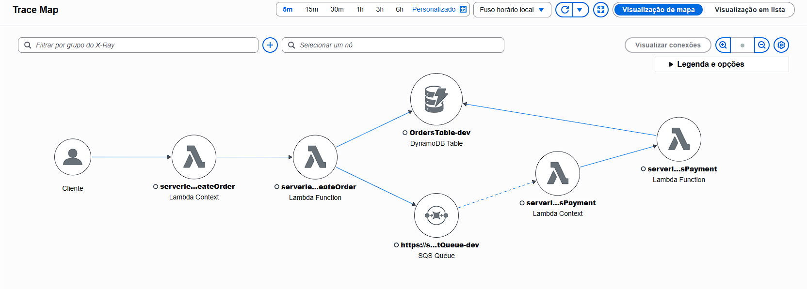
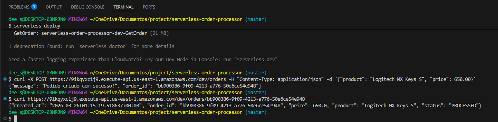
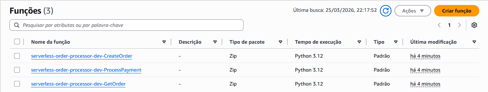
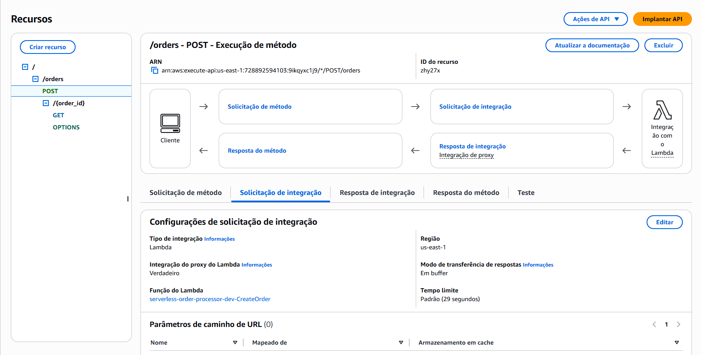
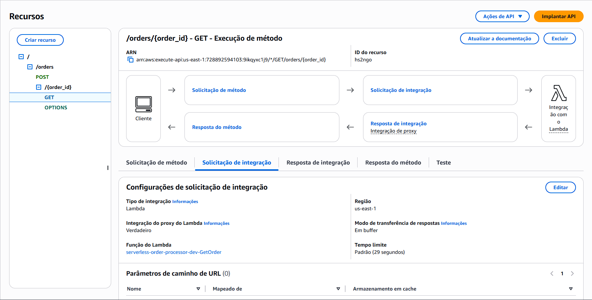
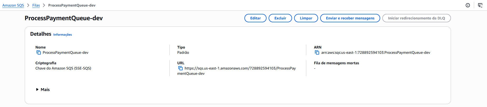
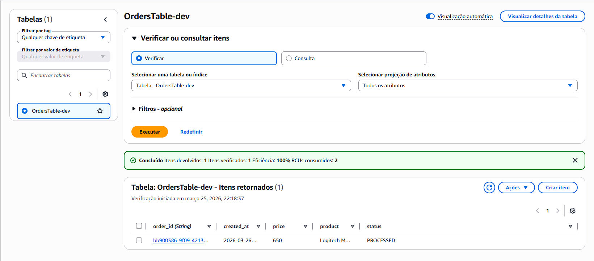
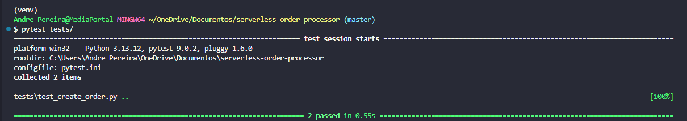

# Serverless Order Processor

Microsserviço serverless construído na AWS para o processamento assíncrono de pedidos de compra.

## 🏗️ Arquitetura e Decisões Técnicas

O sistema foi desenhado para ser resiliente, escalável e totalmente contido no **AWS Free Tier**.

A arquitetura escolhida utiliza **SQS (Simple Queue Service)** em vez de DynamoDB Streams para o processamento assíncrono.
* **Justificativa:** O SQS fornece um excelente desacoplamento entre a recepção do pedido (que precisa ser rápida) e o processamento de pagamento (que pode demorar ou sofrer instabilidades de integrações externas). Isso protege o banco de dados de sobrecargas e permite o controle de falhas de forma independente.
* **Observabilidade e Trace:** O AWS X-Ray está ativado no API Gateway e nas Lambdas. Além disso, o código foi instrumentado com o `aws-xray-sdk` (`patch_all()`), permitindo o rastreamento em nível de código de todas as chamadas feitas pelo `boto3` (DynamoDB e SQS), gerando um Service Map completo para identificação de gargalos.

O mapa de serviço gerado pelo AWS X-Ray ilustra perfeitamente o fluxo assíncrono e a integração entre os componentes:

<div align="center">
  
</div>

**Fluxo da Aplicação:**
1. **API Gateway:** Recebe o `POST /orders` e o `GET /orders/{order_id}`.
2. **Lambda (CreateOrder):** Valida o payload, salva o pedido no DynamoDB com status `PENDING` e publica uma mensagem no SQS.
3. **SQS:** Enfileira os eventos de novos pedidos.
4. **Lambda (ProcessPayment):** Consome a fila SQS, simula o tempo de processamento externo e atualiza o status no DynamoDB para `PROCESSED`.
5. **Lambda (GetOrder):** Permite a consulta do status atualizado do pedido diretamente no DynamoDB.

## 🚀 Tecnologias Utilizadas
* Python 3.12 (boto3, aws-xray-sdk)
* Serverless Framework v3 (com plugin `serverless-python-requirements`)
* Docker (para cross-compilação de dependências nativas)
* AWS Lambda
* Amazon API Gateway
* Amazon DynamoDB
* Amazon SQS
* Pytest (Testes Unitários)

## 💻 Como rodar o projeto

### Pré-requisitos
* **Python 3.12** e Pip
* **Node.js e NPM** (No Windows, pode ser instalado via terminal com: `winget install OpenJS.NodeJS.LTS`)
* **Docker** instalado e rodando (Necessário para o empacotamento das dependências Python via `dockerizePip`).
* **Serverless Framework v3:** `npm install -g serverless@3`
* **Credenciais da AWS** configuradas localmente (`serverless config credentials --provider aws --key KEY --secret SECRET`)

### Instalação e Deploy
1. Clone o repositório:
   ```bash
   git clone https://github.com/andrepsousa/serverless-order-processor.git
   cd serverless-order-processor
   ```
2. Crie e ative o ambiente virtual:
   * **Linux/macOS:**
     ```bash
     python -m venv venv
     source venv/bin/activate
     ```
   * **Windows (PowerShell/CMD):**
     ```powershell
     python -m venv venv
     venv\Scripts\activate
     ```
   * **Windows (Git Bash):**
     ```bash
     source venv/Scripts/activate
     ```
3. Instale as dependências do Python e o plugin do Serverless:
   ```bash
   pip install -r requirements.txt
   npm install
   ```
4. Faça o deploy na AWS (Certifique-se de que o **Docker Desktop** está aberto e rodando):
   ```bash
   serverless deploy
   ```

Abaixo está o registro da execução bem-sucedida do comando `serverless deploy` e os endpoints gerados:

<div align="center">
  
</div>

Após o deploy, podemos verificar as três funções Lambda provisionadas com a runtime Python 3.12:

<div align="center">
  
</div>

## 🧪 Como testar a API

⚠️ **Aviso para usuários Windows:** Recomendamos executar os comandos cURL abaixo utilizando o **Git Bash** para evitar problemas nativos de formatação de aspas do PowerShell.

### 1. Criar um Pedido (POST)
Utilize o comando cURL abaixo (substitua a URL pela gerada no seu deploy):
```bash
curl -X POST https://SUA-URL-AQUI.execute-api.us-east-1.amazonaws.com/dev/orders \
-H "Content-Type: application/json" \
-d '{"product": "Logitech MX Keys S", "price": 650.00}'
```
*(Anote o `order_id` retornado na resposta)*

Este endpoint está configurado no API Gateway para disparar a função `CreateOrder`:

<div align="center">
  
</div>

### 2. Consultar o Pedido (GET)
Substitua `COLE-O-ID-AQUI` pelo UUID que você acabou de gerar:
```bash
curl https://SUA-URL-AQUI.execute-api.us-east-1.amazonaws.com/dev/orders/COLE-O-ID-AQUI
```

Este endpoint está configurado no API Gateway para disparar a função `GetOrder`:

<div align="center">
  
</div>

## 🏗️ Visualizando a Infraestrutura na AWS

Abaixo estão os detalhes da fila SQS e da tabela do DynamoDB criadas pelo Serverless Framework.

### Process Payment Queue (SQS Queue)

<div align="center">
  
</div>

### OrdersTable (DynamoDB Table)
Você pode verificar que a tabela `OrdersTable-dev` já contém um item com o status `PROCESSED`, confirmando que o fluxo completo (POST -> SQS -> ProcessPayment) funcionou corretamente:

<div align="center">
  
</div>

## 🛠️ Testes Unitários
Para rodar a suíte de testes localmente com objetos Mock (sem consumir recursos da AWS), execute:
```bash
pytest tests/
```

Abaixo, a demonstração da execução bem-sucedida dos testes configurados com o `pytest.ini`:

<div align="center">
  
</div>

## 🧹 Limpeza de Recursos
Para garantir que não haja cobranças na conta AWS após os testes, destrua a stack provisionada executando:
```bash
serverless remove
```
Isso deletará as funções Lambda, Tabela do DynamoDB, Fila SQS e o API Gateway.